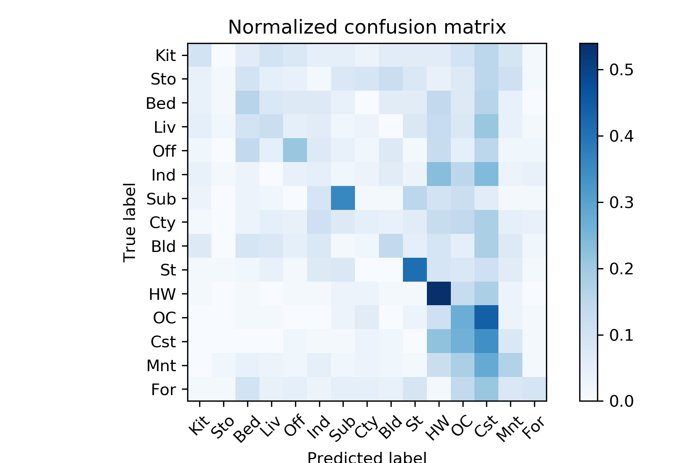
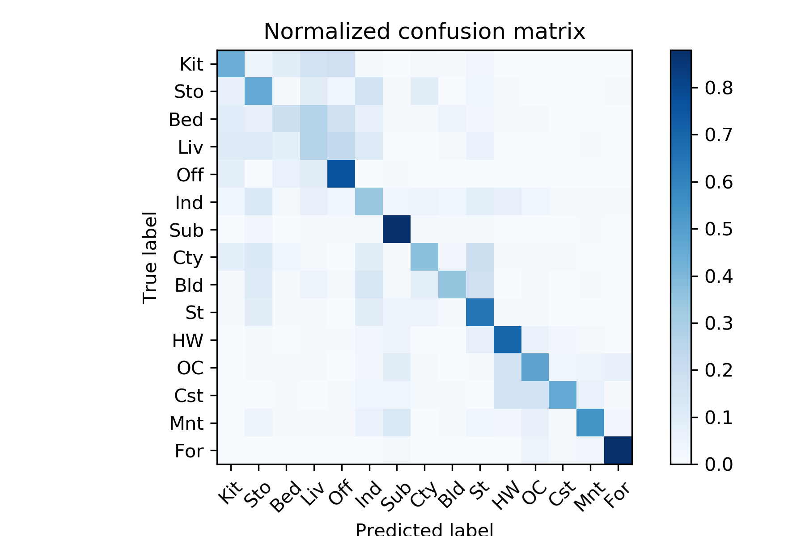
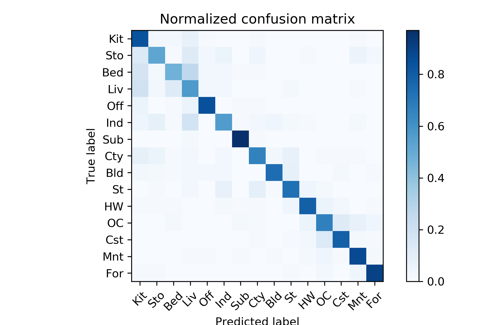

# Scene-recognition-with-bag-of-words

<center>
<p style="color: #666;">
An example of a typical bag of words classification pipeline. Figure by <a href="http://www.robots.ox.ac.uk/~vgg/research/encoding_eval/">Chatfield et al.</a></p><p></p></center>

## Overview
The goal of this project is to solve classical computer vision topic, image recognition. In particular, I examine the task of scene recognition beginning with simplest method, tiny images and KNN(K nearest neighbor) classification, and then move forward to the state-of-the-art techniques, bags of quantized local features and linear classifiers learned by SVC(support vector classifier).

## Implementation
### 1. Tiny Images
In this section, we are going to use `get_tiny_images.py` to  create the tiny images as image representation. Tiny image feature is one of the simplest possible image representations inspired by the work of the same name by Torralba, Fergus, and Freeman. Here I set image size as 16*16. However,  it is not a particularly good representation, because it discards all of the high frequency image content and is not especially shift invariant. Consequently, the accuracy with KNN classifier has relative poor performance, which is only about 20%.

```python3
N = len(image_paths)
size = 16

tiny_images = []

for each in image_paths:
image = Image.open(each)
image = image.resize((size, size))
image = (image - np.mean(image))/np.std(image)
image = image.flatten()
tiny_images.append(image)

tiny_images = np.asarray(tiny_images)
```

### 2. K-Nearest Neighbor Classifier(KNN)
The nearest neighbor classifier is equally simple to understand. When tasked with classifying a test feature into a particular category, one simply finds the "nearest" training example (L2 distance is a sufficient metric) and assigns the test case the label of that nearest training example. In my code, I also used euclidean distance(L2-norm) to measure how far the examples were. ```distance.cdist``` is a efficient function to calculate the distance. Moreover, I also implemented KNN method in my code, which had huge influence during testing. Theoretically, K=3~5 should have better performance. Nevertheless, I got the highest accuracy with K=1, which was same as normal nearest neighbor classifier, no matter combined with what kind of representations.

```python
CATEGORIES = ['Kitchen', 'Store', 'Bedroom', 'LivingRoom', 'Office',
'Industrial', 'Suburb', 'InsideCity', 'TallBuilding', 'Street',
'Highway', 'OpenCountry', 'Coast', 'Mountain', 'Forest']

K = 1

dist = distance.cdist(test_image_feats, train_image_feats, metric='euclidean')
test_predicts = []

for each in dist:
label = []
idx = np.argsort(each)
for i in range(K):
label.append(train_labels[idx[i]])

amount = 0
for item in CATEGORIES:
if label.count(item) > amount:
label_final = item

test_predicts.append(label_final)
```

### 3. Vocabulary of Visual Words
After implementing a baseline scene recognition pipeline, we can finally move on to a more sophisticated image representation, bags of quantized SIFT features. Before we can represent our training and testing images as bag of feature histograms, we first need to establish a vocabulary of visual words. To create a vocabulary, we are going to sample several local feature based on SIFT descriptors, and then clustering them with kmeans. ```dsift(fast=True)``` is a efficient method to get SIFT descriptors, while ```kmeans()``` can return the cluster centroids. The number of clusters plays an important role, the larger the size, the better the performance. I set ```step_size=[5, 5]``` in order to accelerate the code.

NOTE: In this section, we have to run ```build_vocabulary.py```, which will take some time to construct the vocabulary.

```python3
bag_of_features = []

for path in image_paths:
img = np.asarray(Image.open(path),dtype='float32')
frames, descriptors = dsift(img, step=[5,5], fast=True)
bag_of_features.append(descriptors)
bag_of_features = np.concatenate(bag_of_features, axis=0).astype('float32')

vocab = kmeans(bag_of_features, vocab_size, initialization="PLUSPLUS")        
```

### 4. Beg of SIFT
Now we are ready to represent our training and testing images as histograms of visual words. Theoretically, we will get a plenty of SIFT descriptors with ```dsift()``` function. Instead of storing hundreds of SIFT descriptors, we simply count how many SIFT descriptors fall into each cluster in our visual word vocabulary. We use euclidean distance to measure which cluster the descriptor belongs, creating corresponding histograms of visual words of each image. I have noticed that parameter  ```step``` varied accuracy quite a lot. I have tried with step=[5,5], step=[2,2] and step=[1,1]. Based on the experiment, the smaller the step, the higher the accuracy. It might because smaller step size can captere more details, contributing to more precise prediction. To avoid the wrong prediction due to various image size, I also normalized the histogram here.

```python
with open('vocab.pkl', 'rb') as handle:
vocab = pickle.load(handle)

image_feats = []

for path in image_paths:
img = np.asarray(Image.open(path),dtype='float32')
frames, descriptors = dsift(img, step=[1,1], fast=True)
dist = distance.cdist(vocab, descriptors, metric='euclidean')
idx = np.argmin(dist, axis=0)
hist, bin_edges = np.histogram(idx, bins=len(vocab))
hist_norm = [float(i)/sum(hist) for i in hist]

image_feats.append(hist_norm)
image_feats = np.asarray(image_feats)

```

### 5. SVMs(Support Vector Machines)
The last task is to train 1-vs-all linear SVMS to operate in the bag of SIFT feature space. Linear classifiers are one of the simplest possible learning models. The feature space is partitioned by a learned hyperplane and test cases are categorized based on which side of that hyperplane they fall on. ```LinearSVC()``` of scikit-learn provides a convenient way to implement SVMs. In addition, the parameter ```multi-class='ovr'``` realizes multi-class prediction. Hyperparameter tuning is extremely significant in this part, especially ```C```. I have tried with various value, from 1.0 to 5000.0, and the highest accuracy showed up on C=700.

```python
SVC = LinearSVC(C=700.0, class_weight=None, dual=True, fit_intercept=True,
intercept_scaling=1, loss='squared_hinge', max_iter= 2000,
multi_class='ovr', penalty='l2', random_state=0, tol= 1e-4,
verbose=0)

SVC.fit(train_image_feats, train_labels)
pred_label = SVC.predict(test_image_feats)
```

## Installation
1. Install [cyvlfeat](https://github.com/menpo/cyvlfeat) by running `conda install -c menpo cyvlfeat`
2. Run ```proj3.py```

Note: To tune the hyperparameter, please modify them directly in corresponding ```.py``` file, such as K(number of neighbors) in ```nearest_neighbor_classify.py```, C(penalty) in ```svm_classify```.

## Accuracy
```
Accuracy =  0.7286666666666667
Kitchen: 0.84
Store: 0.52
Bedroom: 0.47
LivingRoom: 0.57
Office: 0.85
Industrial: 0.56
Suburb: 0.97
InsideCity: 0.66
TallBuilding: 0.74
Street: 0.73
Highway: 0.79
OpenCountry: 0.67
Coast: 0.79
Mountain: 0.87
Forest: 0.9
```

## Results
Not surprisiingly, tiny image features and nearest neighbor classifier has the worst accuracy about 0.2 with K=1, while bag of sift features has far better performance than it. Bag of sift features with nearest neighbor classifier(K=1) reaches 0.52, whereas with linear SVM classifier reaches up to 0.73.

<table border=0 cellpadding=4 cellspacing=1>
<tr>
<th colspan=2>Confusion Matrix</th>
</tr>
<tr>
<td>Tiny Image ft. Nearest Neighbor</td>
<td>0.20133333333333334</td>
<td bgcolor=LightBlue></td>
</tr>
<tr>
<td>Bag of SIFT ft. Nearest Neighbor</td>
<td> 0.5173333333333333</td>
<td bgcolor=LightBlue></td>
</tr>
<tr>
<td>Bag of SIFT ft. Linear SVM</td>
<td> 0.7286666666666667</td>
<td bgcolor=LightBlue></td>
</tr>
</table>

## Visualization
| Category name | Sample training images | Sample true positives | False positives with true label | False negatives with wrong predicted label |
| :-----------: | :--------------------: | :-------------------: | :-----------------------------: | :----------------------------------------: |
| Kitchen |  |  |  |  |
| Store |  |  |  |  |
| Bedroom |  |  |  |  |
| LivingRoom |  |  |  |  |
| Office |  |  |  |  |
| Industrial |  |  |  |  |
| Suburb |  |  |  |  |
| InsideCity |  |  |  |  |
| TallBuilding |  |  |  |  |
| Street |  |  |  |  |
| Highway |  |  |  |  |
| OpenCountry |  |  |  |  |
| Coast |  |  |  |  |
| Mountain |  |  |  |  |
| Forest |  |  |  |  |

## Credits
This project is modified by Chia-Hung Yuan based on Min Sun, James Hays and Derek Hoiem's previous developed projects 
